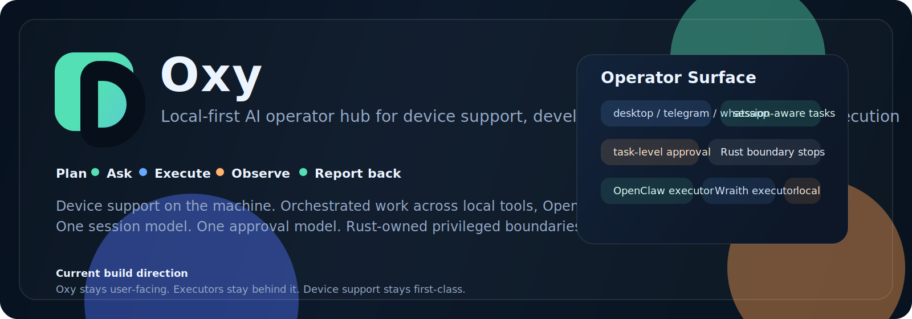

# Caret

Caret is a lightweight local OS assistant for device care, support automation, and safe remediation.

## Product Direction

Caret is being built as:
- a local-first device assistant
- a support-first desktop app for monitoring, cleanup, and small-issue remediation
- a control surface for incidents, escalations, and IT ticketing
- a lightweight packaged app with a bundled local backend and optional local model setup

Caret keeps the visible product narrow and support-first.
Older executor/task capabilities remain dormant in the codebase for stability, but they are not part of the current product surface.

## Visible App Surface

- `Sessions`
- `Support`
- `System`
- `Security`
- `Settings`

## What Caret Does Today

- monitors local device health and creates support incidents
- runs safe auto-fixes for bounded cleanup and readiness tasks
- keeps privileged actions behind Rust-backed approval boundaries
- creates Jira tickets from support incidents
- ships as a Windows desktop installer with a bundled backend sidecar

## Packaging Direction

Caret keeps the installer light by bundling:
- the Tauri desktop shell
- the Rust runtime
- the local backend sidecar
- SQLite state

Caret does not bundle:
- model weights
- Docker
- a full BitNet runtime stack

Local model support should stay optional and use an Ollama-compatible runtime on first setup rather than inflating the installer.

## Fork Lineage

Caret was forked from the preserved personal baseline:
- `personal-oxy-baseline-v0.6.2`

The original Oxy repo remains the personal/internal branch.
Caret is the org-facing product track.

## Source of Truth

- [build/Core_blueprint.md](/Users/marshal/Library/CloudStorage/OneDrive-TWSPartnersAG/Dokumente/Internal%20projects/Caret/build/Core_blueprint.md)
- [build/BUILD_BLUEPRINT.md](/Users/marshal/Library/CloudStorage/OneDrive-TWSPartnersAG/Dokumente/Internal%20projects/Caret/build/BUILD_BLUEPRINT.md)
- [AAHP.md](/Users/marshal/Library/CloudStorage/OneDrive-TWSPartnersAG/Dokumente/Internal%20projects/Caret/AAHP.md)
- [release.json](/Users/marshal/Library/CloudStorage/OneDrive-TWSPartnersAG/Dokumente/Internal%20projects/Caret/release.json)
- [CHANGELOG.md](/Users/marshal/Library/CloudStorage/OneDrive-TWSPartnersAG/Dokumente/Internal%20projects/Caret/CHANGELOG.md)
